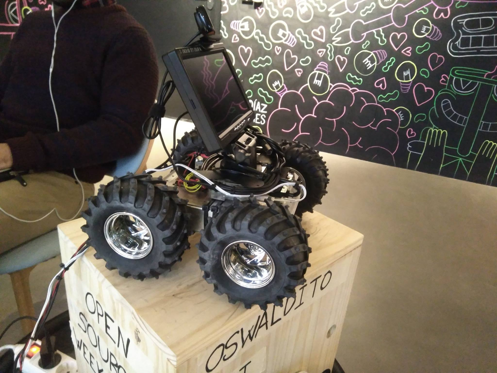
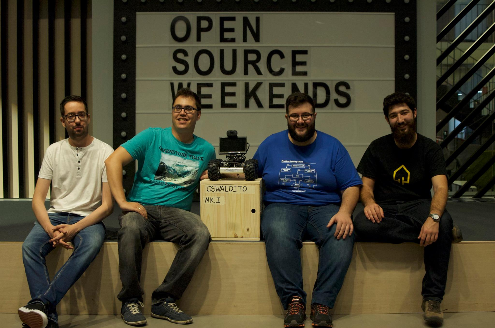
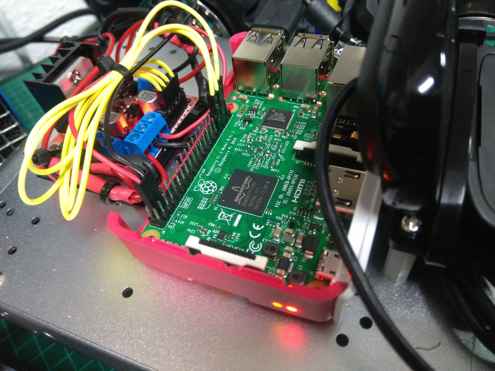
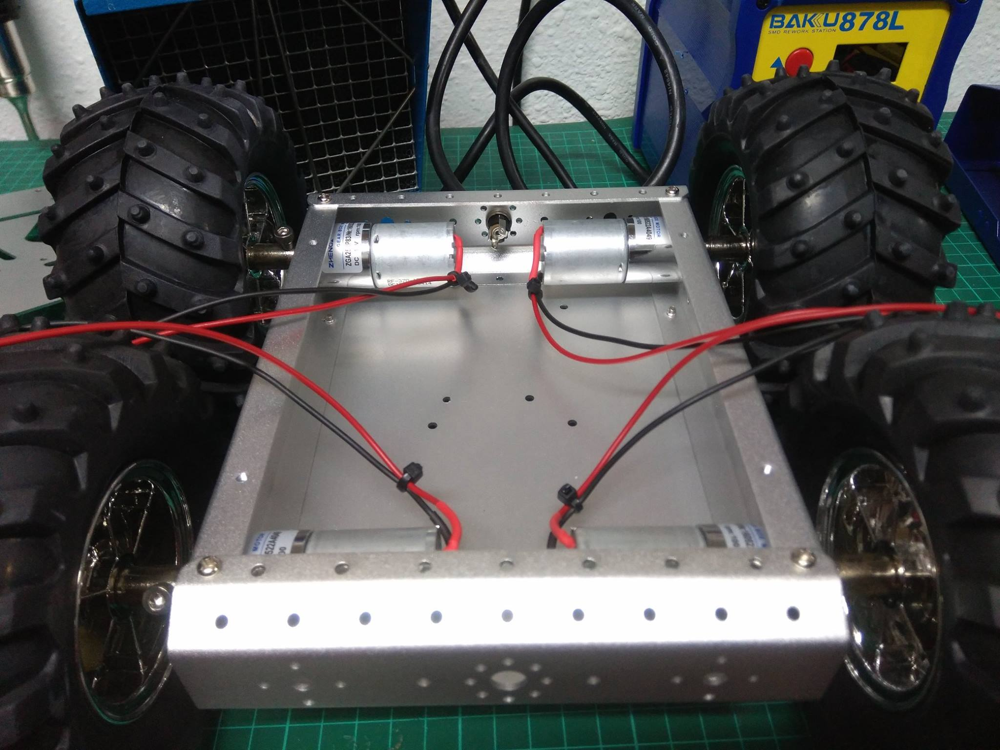

# OSWaldito


Robot Open Source que utilizamos en OSWeekends para gestionar redes sociales, telepresencia, etc....

*PENDIENTE - Lista REDES SOCIALES de OSWaldito*

### Equipo


OSWaldito es un proyecto de Open Source Weekends. Y es considerado un miembro más de la organización.

### Importante

**Arranque manual de FFMPEG**

```bash
sudo ffmpeg -s 320x240 -y -f v4l2 -i /dev/video0 -update 1 -r 30  /home/pi/Desktop/oswaldito/public/cam.jpg
```


### Software

*PENDIENTE - Lista destallada de Software*
OSWaldito utiliza Node.js, Websockets, Pillarsjs, ffmpeg, etc...


### Funcionalidades

*PENDIENTE - Lista de funcionalidades prevista para la versión 0.1.0*

### Hardware


*PENDIENTE - Lista de componentes en la versión 0.1.0*

### Construcción




### Agradecimientos

- [Reloj](public/clock.html) *Gracias a [dtinth en Codepen](http://codepen.io/dtinth/pen/tDihg)*
- [VR simulación](public/vr.html) *Gracias a [sgang007/vrStreamer en Github](https://github.com/sgang007/vrStreamer)*