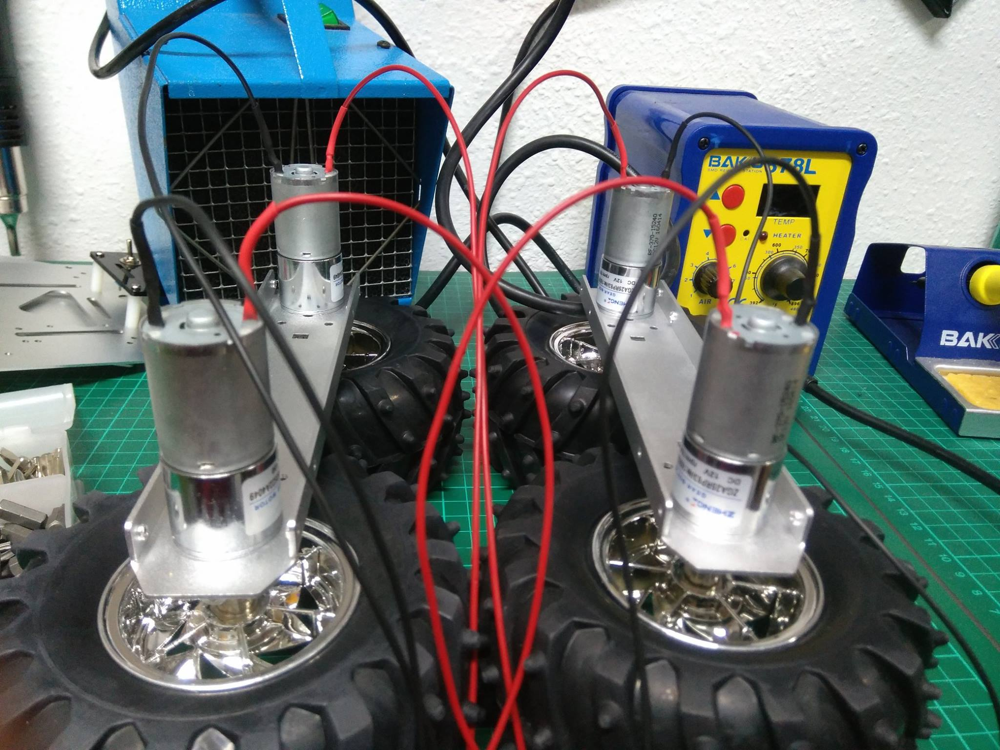

# OSWaldito


Robot Open Source que utilizamos en OSWeekends para gestionar redes sociales, telepresencia, etc....

**Redes Sociales**
- [Twitter (@OSWaldito_bot)](https://twitter.com/oswalditobot)

### Equipo


OSWaldito es un proyecto de Open Source Weekends. Y es considerado un miembro más de la organización.

### Importante

**Arranque manual de FFMPEG**

```bash
sudo ffmpeg -s 320x240 -y -f v4l2 -i /dev/video0 -update 1 -r 30  /home/pi/Desktop/OSWaldito/public/cam.jpg
```


### Software

**Sistema Operativo**
- [Raspbian Jessie](https://www.raspberrypi.org/blog/raspbian-jessie-is-here/)
- [Nodejs](https://nodejs.org/)
- [FFMPEG](https://www.ffmpeg.org/)

**Servidor**
- [pillars](https://www.npmjs.com/package/pillars)
- [rpio](https://www.npmjs.com/package/rpio)
- [socket.io](https://www.npmjs.com/package/socket.io)
- [hangouts-bot](https://www.npmjs.com/package/hangouts-bot)
- [scheduled](https://www.npmjs.com/package/scheduled)
- [slack-node](https://www.npmjs.com/package/slack-node)
- [twitter](https://www.npmjs.com/package/twitter)


**Cliente**
- [three.js](https://threejs.org/)

### Funcionalidades

**Robótica**
- Desplazamiento con WebSocket
- Simulación de VR en Cliente
- Simulación de voz en Cliente (parcial - En desarrollo)
- WebCam Stream frame a frame

**Comunicación**
- Escucha activamente ciertos hashtags de Twitter.
- Escucha activamente conversaciones en Google Hangouts
- Envia mensajes en Google Hangouts
- Envia mensajes en Slack
- Envia mensajes al azar clasificados por prioridad en Slack
- Envia mensajes de Error y estado al administrador en Goolgle Hangouts
- Puede ser desplegado en multiples entornos (Raspbian, Linux, OSX, Windows, C9...)
- Permite desplegar multiples avatares y personalidades desde la configuración para comunicarse en Slack

### Hardware


**Componentes**
- [Raspberry Pi 3 modelo B](https://www.amazon.es/dp/B01CD5VC92)
- [Pantalla - SunFounder 7" HD 1024*600 TFT LCD](https://www.amazon.es/gp/product/B012ZRYDYY)
- [Chasis Robótico - ALSRobot 4WD Aluminum Mobile Robot Platform (Car)](https://www.amazon.com/ALSRobot-Aluminum-Mobile-Robot-Platform/dp/B00ME4FI2U/ref=pd_sbs_21_4?_encoding=UTF8&pd_rd_i=B00ME4FI2U&pd_rd_r=HDKE8MN2G3KJDYD8DKWG&pd_rd_w=w3u5s&pd_rd_wg=Sk1We&psc=1&refRID=HDKE8MN2G3KJDYD8DKWG)
- [WebCam - Logitech C525](https://www.amazon.es/Logitech-C525-Webcam-Micr%C3%B3fono-Negro/dp/B0050FBISI/ref=sr_1_5?s=computers&ie=UTF8&qid=1479673606&sr=1-5&keywords=webcam+logitech)
- [Puente H - Módulo L298N doble puente H DC Stepper para Arduino](https://www.amazon.es/gp/product/B00HNHUYSG)

### Construcción




### Agradecimientos

- [Reloj](public/clock.html) *Gracias a [dtinth en Codepen](http://codepen.io/dtinth/pen/tDihg)*
- [VR simulación](public/vr.html) *Gracias a [sgang007/vrStreamer en Github](https://github.com/sgang007/vrStreamer)*
